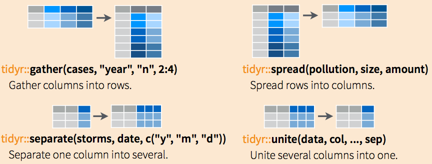

## Course Logistic

* Every Wednesday 19:00 - 21:00
* Slides: http://nikolaypavlov.github.io/da-workshops-1/
* Skype Chat: https://join.skype.com/gjN0CfAd4bhg
* [The Split-Apply-Combine Strategy for Data Analysis](https://www.jstatsoft.org/article/view/v040i01)
* [The R Inferno](http://www.burns-stat.com/pages/Tutor/R_inferno.pdf)
* [Data wrangling with dplyr and tidyr](https://www.rstudio.com/wp-content/uploads/2015/02/data-wrangling-cheatsheet.pdf)
* Install the following packages: openintro, tidyr, dplyr, jsonlite

---
## Topics

* For() vs apply() (special topic)
* How to import data into R
* NA values (special topic)
* Tidying the data
* Split-Apply-Combine strategy

---
## for() loop vs lapply, sapply, aggregate, split...
```{r}
iris[iris$Sepal.Length < 5, 1:3] <- iris[iris$Sepal.Length < 5, 1:3] * 2
mtcars_subs <- mtcars[mtcars$am == 1, ]
aggregate(mpg ~ cyl, data=mtcars_subs, FUN=mean)
```

```{r}
sapply(split(mtcars_subs$mpg, mtcars_subs$cyl), mean)
```

---
## Import from CSV

```{r, echo=F, include=F}
options(warn=-1)
```

```{r}
download.file("http://api.worldbank.org/v2/en/country/ukr?downloadformat=csv",
              destfile="ua.zip")
unzip("ua.zip", exdir="data_dir")
csv_files <- list.files("data_dir", ".*.csv", recursive=T, full.names=T)
data <- read.csv(csv_files[1], skip = 3)
str(data)
```

---
## Raw, tables, XLSX, ODBC, HDF5, Web, XML, etc.

* readLines() - Read some or all text lines from a connection
* read.table() - Table format
* xlsx package - Excel worksheet to data frame
* RODBC, RPostgreSQL, RMySQL, ROracle, RSQLite - Database Access
* jsonlite package - High Performance JSON Parser
* h5 package - Interface to the 'HDF5' file format
* rvest package - web scraping
* XML package - the XML parser

---
## Exercise

```{r, echo=F, include=F}
library(jsonlite)
jsonData <- fromJSON("https://api.github.com/users/nikolaypavlov/repos")
names(jsonData) 
```

Find the most popular repo in my github.

JSON API URL: https://api.github.com/users/nikolaypavlov/repos

Useful functions: fromJSON(), names(), [], which.max() or order()

---
## NA values (special topic)

Check for missing values:

```{r}
sum(is.na(data$X1992))
```

```{r}
any(is.na(data$X1992))
```

```{r}
colSums(is.na(data))
```

---
## NA actions

* complete.cases() - list rows of data that have missing values
* global na.action option: na.omit(), na.pass(), na.fail()
* Try getOption("na.action") 

```{r}
mean(data$X1992, na.rm=TRUE)
```

---
## Tidying the data

* Less time worrying about how to feed the output from one function into the input of another
* Makes data suitable for software processing: math functions, vizualization, etc.
* Reveals information and insights


---
## tidyr package

First identify the variables in your dataset, then use the tools provided by tidyr to move them into columns:



---
## Reshape example

```{r}
library(tidyr)
new_data <- data[,-c(3, ncol(data))] # remove Indicator.Name and last column
data_long <- gather(new_data, key=year, value=measurement,
                    -Country.Name, 
                    -Country.Code, 
                    -Indicator.Code, na.rm=T)      # Wide to long conversion
data_long$year <- extract_numeric(data_long$year)  # Convert year to numeric
names(data_long) <- tolower(names(data_long))      # Fix names
head(data_long)
```

---
## Exercise

```{r, echo=F, include=F}
data_wide <- spread(data_long, key=indicator.code, value=measurement)
names(data_wide) <- gsub("\\.", "_", names(data_wide))
names(data_wide) <- toupper(names(data_wide))

```

1. Go back to the wide format and make each "Indicator.Code" a separate variable
2. Convert "." dots in variable names to underscores "_"
3. Make all variable names uppercase
4. Plot food exports (% of merchandise exports) (TX.VAL.FOOD.ZS.UN)

Useful functions: spread(), names(), gsub(), toupper(), plot(), help()

---
## The Split-Apply-Combine Strategy for Data Analysis

### dplyr package

There are seven fundamental functions of data transformation:

* select() selecting variables
* filter() provides basic filtering capabilities
* group_by() groups data by categorical levels
* summarise() summarise data by functions of choice
* arrange() ordering data
* join() joining separate dataframes
* mutate() create new variables

---
## Example

```{r}
library(dplyr)
data_sub <- select(data_long, indicator.code, year, measurement)
data_200X <- filter(data_sub, year >= 2000 & year <= 2010)
data_by_code <- group_by(data_200X, indicator.code)
mean_stats <- summarise(data_by_code, 
                        avg=mean(measurement), 
                        max=max(measurement),
                        min=min(measurement))
head(as.data.frame(mean_stats))
```

---
## The same, but with pipe %>%

```{r}
data_long <- data %>% 
  select(-Indicator.Name, -X) %>%
  gather(key=year, value=measurement, 
         -Country.Name, 
         -Country.Code, 
         -Indicator.Code, na.rm=T) %>%
  mutate(year=extract_numeric(year))

names(data_long) <- tolower(names(data_long))
head(data_long)
```

---
## The same, but with pipe %>%

```{r}
mean_stats <- data_long %>%
  select(indicator.code, year, measurement) %>%
  filter(year >= 2000 & year <= 2010) %>%
  group_by(indicator.code) %>%
  summarise(avg=mean(measurement), 
            max=max(measurement), 
            min=min(measurement))

head(as.data.frame(mean_stats))
```

---
## Exercise

1. Choose either data_long from my last solution or data_wide from your last exercise.
2. Select all export related indicators (TX) between 1995-2005
3. Make sure to replace NAs with the appropriate variable mean
4. Calculate max() summary statistics.

```{r, echo=F, include=F}
solution1 <- data_wide %>% 
  select(YEAR, starts_with("TX")) %>%
  filter(YEAR >= 1995 & YEAR <= 2005) %>%
  mutate_each(funs(ifelse(is.na(.), mean(., na.rm=T), .)), -YEAR) %>%
  summarise_each(funs(max), -YEAR)
```

```{r, echo=F, include=F}
solution2 <- data_long %>% 
  select(year, indicator.code, measurement) %>%
  filter(grepl("TX\\.", indicator.code) & 
           year >= 1995 & 
           year <= 2005) %>%
  group_by(indicator.code) %>%
  mutate(measurement = ifelse(is.na(measurement), 
                              mean(measurement, na.rm=T), 
                              measurement)) %>%
  summarise(max=max(measurement))

solution2 <- as.data.frame(solution2)
```

If you choose to start from "wide" format, try: select() and it's helper functions, filter(), mutate_each(), ifelse(), is.na(), summarise_each().

In case of "long" format, try: select(), filter(), grepl(), group_by(), mutate(), is.na().

Hint: make sure you are using mean() with na.rm=TRUE argument.

---
## Other base functions and packages to consider

apply() and family, aggregate(), split(), with(), order(), reshape2, stringr, plyr, data.table

---
## Homework

* Skype Chat for discussions: https://join.skype.com/gjN0CfAd4bhg
* [The Split-Apply-Combine Strategy for Data Analysis](https://www.jstatsoft.org/article/view/v040i01)
* [The R Inferno](http://www.burns-stat.com/pages/Tutor/R_inferno.pdf)
* Try different solution for the last exercise
