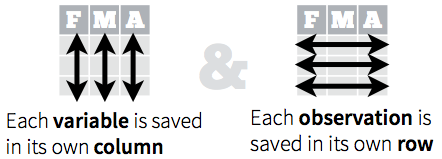

## Course Logistic

* Every Wednesday 19:00 - 21:00
* Slides: http://nikolaypavlov.github.io/da-workshops-1/
* Skype Chat: https://join.skype.com/gjN0CfAd4bhg
* [The Split-Apply-Combine Strategy for Data Analysis](https://www.jstatsoft.org/article/view/v040i01)
* [The R Inferno](http://www.burns-stat.com/pages/Tutor/R_inferno.pdf)
* [Data wrangling with dplyr and tidyr](https://www.rstudio.com/wp-content/uploads/2015/02/data-wrangling-cheatsheet.pdf)
* Install the following packages: openintro, tidyr, dplyr, jsonlite

---
## Topics

* For() vs apply() (special topic)
* How to import data into R
* NA values (special topic)
* Tidying the data
* Split-Apply-Combine strategy

---
## for() loop vs lapply, sapply, aggregate, split...

```r
iris[iris$Sepal.Length < 5, 1:3] <- iris[iris$Sepal.Length < 5, 1:3] * 2
mtcars_subs <- mtcars[mtcars$am == 1, ]
aggregate(mpg ~ cyl, data=mtcars_subs, FUN=mean)
```

```
##   cyl      mpg
## 1   4 28.07500
## 2   6 20.56667
## 3   8 15.40000
```


```r
sapply(split(mtcars_subs$mpg, mtcars_subs$cyl), mean)
```

```
##        4        6        8 
## 28.07500 20.56667 15.40000
```

---
## Import from CSV


```r
download.file("http://api.worldbank.org/v2/en/country/ukr?downloadformat=csv",
              destfile="ua.zip")
unzip("ua.zip", exdir="data_dir")
csv_files <- list.files("data_dir", ".*.csv", recursive=T, full.names=T)
data <- read.csv(csv_files[1], skip = 3)
str(data)
```

```
## 'data.frame':	1345 obs. of  61 variables:
##  $ Country.Name  : Factor w/ 1 level "Ukraine": 1 1 1 1 1 1 1 1 1 1 ...
##  $ Country.Code  : Factor w/ 1 level "UKR": 1 1 1 1 1 1 1 1 1 1 ...
##  $ Indicator.Name: Factor w/ 1345 levels "2005 PPP conversion factor, GDP (LCU per international $)",..: 54 402 403 53 52 87 86 85 694 953 ...
##  $ Indicator.Code: Factor w/ 1345 levels "AG.AGR.TRAC.NO",..: 1 2 3 4 5 6 7 8 9 10 ...
##  $ X1960         : num  NA NA NA NA NA NA NA NA NA NA ...
##  $ X1961         : num  NA NA NA NA NA NA NA NA NA NA ...
##  $ X1962         : num  NA NA NA NA NA NA NA NA NA NA ...
##  $ X1963         : num  NA NA NA NA NA NA NA NA NA NA ...
##  $ X1964         : num  NA NA NA NA NA NA NA NA NA NA ...
##  $ X1965         : num  NA NA NA NA NA NA NA NA NA NA ...
##  $ X1966         : num  NA NA NA NA NA NA NA NA NA NA ...
##  $ X1967         : num  NA NA NA NA NA NA NA NA NA NA ...
##  $ X1968         : num  NA NA NA NA NA NA NA NA NA NA ...
##  $ X1969         : num  NA NA NA NA NA NA NA NA NA NA ...
##  $ X1970         : num  NA NA NA NA NA NA NA NA NA NA ...
##  $ X1971         : num  NA NA NA NA NA NA NA NA NA NA ...
##  $ X1972         : num  NA NA NA NA NA NA NA NA NA NA ...
##  $ X1973         : num  NA NA NA NA NA NA NA NA NA NA ...
##  $ X1974         : num  NA NA NA NA NA NA NA NA NA NA ...
##  $ X1975         : num  NA NA NA NA NA NA NA NA NA NA ...
##  $ X1976         : num  NA NA NA NA NA NA NA NA NA NA ...
##  $ X1977         : num  NA NA NA NA NA NA NA NA NA NA ...
##  $ X1978         : num  NA NA NA NA NA NA NA NA NA NA ...
##  $ X1979         : num  NA NA NA NA NA NA NA NA NA NA ...
##  $ X1980         : num  NA NA NA NA NA NA NA NA NA NA ...
##  $ X1981         : num  NA NA NA NA NA NA NA NA NA NA ...
##  $ X1982         : num  NA NA NA NA NA NA NA NA NA NA ...
##  $ X1983         : num  NA NA NA NA NA NA NA NA NA NA ...
##  $ X1984         : num  NA NA NA NA NA NA NA NA NA NA ...
##  $ X1985         : num  NA NA NA NA NA NA NA NA NA NA ...
##  $ X1986         : num  NA NA NA NA NA NA NA NA NA NA ...
##  $ X1987         : num  NA NA NA NA NA NA NA NA NA NA ...
##  $ X1988         : num  NA NA NA NA NA NA NA NA NA NA ...
##  $ X1989         : num  NA NA NA NA NA NA NA NA NA NA ...
##  $ X1990         : num  NA NA NA NA NA NA NA NA NA NA ...
##  $ X1991         : num  NA NA NA NA NA NA NA NA NA NA ...
##  $ X1992         : num  511500 NA NA 419290 72.4 ...
##  $ X1993         : num  511479 NA NA 418900 72.3 ...
##  $ X1994         : num  498743 NA NA 418610 72.3 ...
##  $ X1995         : num  469301 NA NA 418530 72.2 ...
##  $ X1996         : num  441657 NA NA 418400 72.2 ...
##  $ X1997         : num  405784 NA NA 418540 72.2 ...
##  $ X1998         : num  374166 NA NA 416110 71.8 ...
##  $ X1999         : num  347247 NA NA 414530 71.6 ...
##  $ X2000         : num  318900 NA NA 414060 71.5 ...
##  $ X2001         : num  413625 NA NA 413850 71.4 ...
##  $ X2002         : num  404259 22.8 15.9 413960 71.5 ...
##  $ X2003         : num  390838 20.8 15.8 413550 71.4 ...
##  $ X2004         : num  370404 22.4 16.4 413540 71.4 ...
##  $ X2005         : num  352252 20.9 17.2 413040 71.3 ...
##  $ X2006         : num  344263 20.7 21.6 412840 71.3 ...
##  $ X2007         : num  336848 31.8 27.6 412660 71.2 ...
##  $ X2008         : num  335473 40 32.8 412920 71.3 ...
##  $ X2009         : num  333529 42.2 27.3 412760 71.2 ...
##  $ X2010         : num  NA 50.5 32.7 412670 71.2 ...
##  $ X2011         : num  NA 44.9 38.9 412810 71.3 ...
##  $ X2012         : num  NA 48 41.3 412970 71.3 ...
##  $ X2013         : num  NA 67.6 45.8 412750 71.2 ...
##  $ X2014         : num  NA NA NA NA NA NA NA NA NA NA ...
##  $ X2015         : num  NA NA NA NA NA NA NA NA NA NA ...
##  $ X             : logi  NA NA NA NA NA NA ...
```

---
## Raw, tables, XLSX, ODBC, HDF5, Web, XML, etc.

* readLines() - Read some or all text lines from a connection
* read.table() - Table format
* xlsx package - Excel worksheet to data frame
* RODBC, RPostgreSQL, RMySQL, ROracle, RSQLite - Database Access
* jsonlite package - High Performance JSON Parser
* h5 package - Interface to the 'HDF5' file format
* rvest package - web scraping
* XML package - the XML parser

---
## Exercise


Find the most popular repo in my github.

JSON API URL: https://api.github.com/users/nikolaypavlov/repos

Useful functions: fromJSON(), names(), [], which.max() or order()

---
## NA values (special topic)

Check for missing values:


```r
sum(is.na(data$X1992))
```

```
## [1] 742
```


```r
any(is.na(data$X1992))
```

```
## [1] TRUE
```


```r
colSums(is.na(data))
```

```
##   Country.Name   Country.Code Indicator.Name Indicator.Code          X1960 
##              0              0              0              0           1306 
##          X1961          X1962          X1963          X1964          X1965 
##           1307           1306           1307           1307           1304 
##          X1966          X1967          X1968          X1969          X1970 
##           1308           1307           1308           1308           1295 
##          X1971          X1972          X1973          X1974          X1975 
##           1285           1285           1286           1286           1290 
##          X1976          X1977          X1978          X1979          X1980 
##           1280           1280           1281           1281           1275 
##          X1981          X1982          X1983          X1984          X1985 
##           1274           1268           1269           1269           1268 
##          X1986          X1987          X1988          X1989          X1990 
##           1272           1247           1222           1190           1032 
##          X1991          X1992          X1993          X1994          X1995 
##           1032            742            713            686            628 
##          X1996          X1997          X1998          X1999          X2000 
##            625            606            590            507            460 
##          X2001          X2002          X2003          X2004          X2005 
##            496            449            471            456            301 
##          X2006          X2007          X2008          X2009          X2010 
##            334            334            303            307            294 
##          X2011          X2012          X2013          X2014          X2015 
##            308            265            398            659           1265 
##              X 
##           1345
```

---
## NA actions

* complete.cases() - list rows of data that have missing values
* global na.action option: na.omit(), na.pass(), na.fail()
* Try getOption("na.action") 


```r
mean(data$X1992, na.rm=TRUE)
```

```
## [1] 13005266733
```

---
## Tidying the data

* Less time worrying about how to feed the output from one function into the input of another
* Makes data suitable for software processing: math functions, vizualization, etc.
* Reveals information and insights



---
## tidyr package

First identify the variables in your dataset, then use the tools provided by tidyr to move them into columns:


---
## Reshape example


```r
library(tidyr)
new_data <- data[,-c(3, ncol(data))] # remove Indicator.Name and last column
data_long <- gather(new_data, key=year, value=measurement,
                    -Country.Name, 
                    -Country.Code, 
                    -Indicator.Code, na.rm=T)      # Wide to long conversion
data_long$year <- extract_numeric(data_long$year)  # Convert year to numeric
names(data_long) <- tolower(names(data_long))      # Fix names
head(data_long)
```

```
##     country.name country.code    indicator.code year  measurement
## 417      Ukraine          UKR       EN.URB.LCTY 1960 1.163046e+06
## 418      Ukraine          UKR EN.URB.LCTY.UR.ZS 1960 5.826162e+00
## 419      Ukraine          UKR       EN.URB.MCTY 1960 2.824547e+06
## 420      Ukraine          UKR EN.URB.MCTY.TL.ZS 1960 6.620733e+00
## 618      Ukraine          UKR       IT.CEL.SETS 1960 0.000000e+00
## 619      Ukraine          UKR    IT.CEL.SETS.P2 1960 0.000000e+00
```

---
## Exercise


1. Go back to the wide format and make each "Indicator.Code" a separate variable
2. Convert "." dots in variable names to underscores "_"
3. Make all variable names uppercase
4. Plot food exports (% of merchandise exports) (TX.VAL.FOOD.ZS.UN)

Useful functions: spread(), names(), gsub(), toupper(), plot(), help()

---
## The Split-Apply-Combine Strategy for Data Analysis

### dplyr package

There are seven fundamental functions of data transformation:

* select() selecting variables
* filter() provides basic filtering capabilities
* group_by() groups data by categorical levels
* summarise() summarise data by functions of choice
* arrange() ordering data
* join() joining separate dataframes
* mutate() create new variables

---
## Example


```r
library(dplyr)
data_sub <- select(data_long, indicator.code, year, measurement)
data_200X <- filter(data_sub, year >= 2000 & year <= 2010)
data_by_code <- group_by(data_200X, indicator.code)
mean_stats <- summarise(data_by_code, 
                        avg=mean(measurement), 
                        max=max(measurement),
                        min=min(measurement))
head(as.data.frame(mean_stats))
```

```
##      indicator.code          avg          max          min
## 1    AG.AGR.TRAC.NO 3.600391e+05 4.136250e+05 3.189000e+05
## 2 AG.CON.FERT.PT.ZS 3.024489e+01 5.046149e+01 2.071804e+01
## 3    AG.CON.FERT.ZS 2.303103e+01 3.278684e+01 1.577836e+01
## 4    AG.LND.AGRI.K2 4.132591e+05 4.140600e+05 4.126600e+05
## 5    AG.LND.AGRI.ZS 7.133263e+01 7.146975e+01 7.123056e+01
## 6    AG.LND.ARBL.HA 3.248800e+07 3.256400e+07 3.243400e+07
```

---
## The same, but with pipe %>%


```r
data_long <- data %>% 
  select(-Indicator.Name, -X) %>%
  gather(key=year, value=measurement, 
         -Country.Name, 
         -Country.Code, 
         -Indicator.Code, na.rm=T) %>%
  mutate(year=extract_numeric(year))

names(data_long) <- tolower(names(data_long))
head(data_long)
```

```
##   country.name country.code    indicator.code year  measurement
## 1      Ukraine          UKR       EN.URB.LCTY 1960 1.163046e+06
## 2      Ukraine          UKR EN.URB.LCTY.UR.ZS 1960 5.826162e+00
## 3      Ukraine          UKR       EN.URB.MCTY 1960 2.824547e+06
## 4      Ukraine          UKR EN.URB.MCTY.TL.ZS 1960 6.620733e+00
## 5      Ukraine          UKR       IT.CEL.SETS 1960 0.000000e+00
## 6      Ukraine          UKR    IT.CEL.SETS.P2 1960 0.000000e+00
```

---
## The same, but with pipe %>%


```r
mean_stats <- data_long %>%
  select(indicator.code, year, measurement) %>%
  filter(year >= 2000 & year <= 2010) %>%
  group_by(indicator.code) %>%
  summarise(avg=mean(measurement), 
            max=max(measurement), 
            min=min(measurement))

head(as.data.frame(mean_stats))
```

```
##      indicator.code          avg          max          min
## 1    AG.AGR.TRAC.NO 3.600391e+05 4.136250e+05 3.189000e+05
## 2 AG.CON.FERT.PT.ZS 3.024489e+01 5.046149e+01 2.071804e+01
## 3    AG.CON.FERT.ZS 2.303103e+01 3.278684e+01 1.577836e+01
## 4    AG.LND.AGRI.K2 4.132591e+05 4.140600e+05 4.126600e+05
## 5    AG.LND.AGRI.ZS 7.133263e+01 7.146975e+01 7.123056e+01
## 6    AG.LND.ARBL.HA 3.248800e+07 3.256400e+07 3.243400e+07
```

---
## Exercise

1. Choose either data_long from my last solution or data_wide from your last exercise.
2. Select all export related indicators (TX) between 1995-2005
3. Make sure to replace NAs with the appropriate variable mean
4. Calculate max() summary statistics.


If you choose to start from "wide" format, try: select() and it's helper functions, filter(), mutate_each(), ifelse(), is.na(), summarise_each().

In case of "long" format, try: select(), filter(), grepl(), group_by(), mutate(), is.na().

Hint: make sure you are using mean() with na.rm=TRUE argument.

---
## Other base functions and packages to consider

apply() and family, aggregate(), split(), with(), order(), reshape2, stringr, plyr, data.table

---
## Homework

* Skype Chat for discussions: https://join.skype.com/gjN0CfAd4bhg
* [The Split-Apply-Combine Strategy for Data Analysis](https://www.jstatsoft.org/article/view/v040i01)
* [The R Inferno](http://www.burns-stat.com/pages/Tutor/R_inferno.pdf)
* Try different solution for the last exercise.
